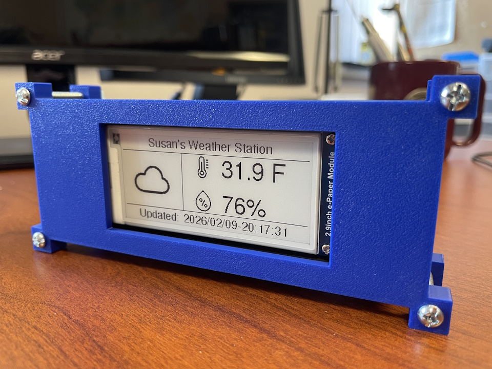

# The-Funky-Weather-Station

## Description

This is a weather-station device built with an ESP32-C3 board and a Waveshare 2.9" e-paper display. It retrieves weather info from OpenWeatherMap. Time and date is also retrieved and displayed. Device needs access to a WiFi router. This repository contains all the design files for anyone to be able to replicate it.

## Video description
